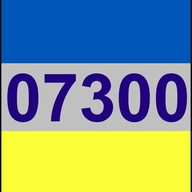

# Clear Sky

**Unofficial air-raid and drone tracker for Kyiv, Kyiv oblast and the oblasts around it.**

A single Python service (standard library only) reads the official «Повітряна тривога» alert data raion
by raion, and six public Telegram channels — the Air Force and the live trackers of the Kyiv sky — parses the
Ukrainian text, and shows what was reported in two ways: **Tactical** (`/m`), the full map with the evidence
behind every mark, and **Light** (`/light`), one place, its raion's official status and what is within 30 km.

> ### ⚠ This is not an official warning system
>
> Positions are **what a public post said**, machine-read — never radar, never exact, sometimes
> wrong. Follow the official *Повітряна тривога* app and the sirens first, and **go to a shelter as
> soon as an alert starts**. Nothing here should ever be used to decide it is safe to stay outside,
> to delay taking cover, or to go and watch. See [docs/SAFETY.md](docs/SAFETY.md) for the rules the
> code itself follows.

<p align="center">
  
</p>

---

## Quick start

```bash
git clone https://github.com/Dread92/clear-sky.git
cd clear-sky
python app/server.py --demo          # fake alerts, no token needed
```

Open **http://localhost:8642/m**.

For real data, copy the config template and add a token (free, see [Sources](#sources)):

```bash
cp config.example.json config.json   # Windows: copy config.example.json config.json
# put your alerts.in.ua token in "alerts_in_ua_token", then:
python app/server.py
```

Windows: double-click **`start.bat`** — it installs the one optional dependency, starts the service
and opens the browser. Linux/macOS: `scripts/start.sh`.

*French quick start: [docs/DEMARRAGE-FR.md](docs/DEMARRAGE-FR.md).*

## What it does

| | |
|---|---|
| **Alerts by raion** | Each raion coloured by its own official alert, at the government app's level — red (massed drones, missiles) or yellow (drones) — never the whole oblast for one raion. |
| **Light version** | `/light`: Home, Work, Kids or a pin; the official status of that place's raion; a 30 km radar over a small local map; tap a row for what the post said. The places never leave the phone. |
| **Targets where they were reported** | Shaheds are drawn loitering around the reported point (their real path is erratic) with a chevron for the reported heading. No extrapolated trajectory unless you switch on EST, no invented ETA — [why](docs/SAFETY.md#no-liberties-with-trajectories). |
| **Per-target justification** | Tap any marker: the sentence it came from, the channel, the time, how position / heading / count were read, the confidence, and other reports nearby. |
| **Goes grey, then goes away** | A target with no new report for 5 minutes turns grey with a `?`, fades in steps, and disappears after 15 minutes. Stale is never shown as active. |
| **Preventive warnings** | MiG-31K take-off and ballistic threats raise a banner *before* anything is seen — and it disappears the moment a later post lifts it. Nightly *assessments* ("threats are above average tonight") are classified as forecasts and never raise it. |
| **Missile mode** | Refresh drops from 15 s to 5 s while a ballistic or cruise-missile threat is open. |
| **History layer** | Explosions ✸ and confirmed shoot-downs ✕ over the last 24 / 48 / 72 h. |
| **Stats** | Alerts per day, time of day, longest alert, explosions and shoot-downs by oblast, and what the Air Force says was *launched* over Ukraine (24 h / 7 d / 30 d) — kept separate from the count of *reports*, which is a volume of posts, not of targets. |
| **Three languages** | Full UI in 🇬🇧 English, 🇺🇦 Ukrainian, 🇫🇷 French — including place names, raions, districts and channel names. See [docs/I18N.md](docs/I18N.md). |
| **Altitude when it is stated** | A post saying `знижується` marks the target ↓ DESCENDING in crimson — it is diving. Climbing, low, high and values in metres are read the same way. Never inferred: no public source publishes altitude. |
| **Push notifications** | Web Push (VAPID / RFC 8291, hand-rolled on `cryptography`) wakes the phone with the app closed — for a target reported within your radius, a MiG-31K take-off or a ballistic threat. No siren-start or all-clear pushes: the siren already says that. |
| **Share in one tap** | The status of any target as text, for a chat: what, where, when, descent, heading, distance, source, and the caveat that it is not radar. |
| **Install as an app** | A PWA: add it to the home screen and it runs full-screen with no browser bar. No store, no download. |
| **Blackout mode** | For 2G during an attack: black and white, no tiles, no images, minimal data. |
| **Knows when it is stale** | A page left open for days notices that the server has a newer build and offers a one-tap reload. |
| **Your place** | Pick an oblast for the status band and, optionally, a precise place: targets heading there or within 10 km alert first. |

## Layout

```
clear-sky/
├── app/                    the service — four modules, no framework
│   ├── server.py           HTTP + API + SSE, pollers, SQLite store, marker logic
│   ├── geo.py              Ukrainian parsing: places, declensions, headings, counts, channel formats
│   ├── translate.py        offline UA→EN glossary; DeepL / Google machine translation, on demand
│   └── push.py             Web Push: VAPID ES256 JWT + aes128gcm
├── static/                 the whole front end
│   ├── kyiv.html           Tactical: SVG map, markers, sheets, stats (one self-contained page)
│   ├── light.html          Light: one place, its raion, a 30 km radar (one self-contained page)
│   ├── light-map.json      raion outlines, rivers, roads, towns for the Light map (built)
│   ├── i18n.js             EN / UK / FR strings, place and channel names
│   ├── kyiv-map.json       27 oblasts + 136 raions, projected to km around Kyiv
│   ├── kyiv-districts.json the 10 Kyiv city districts (OSM boundaries)
│   ├── sw.js               service worker (push + notification clicks)
│   └── manifest.json       PWA manifest ("add to home screen")
├── data/                   ua_regions.json (official region ids, built) · corpus.jsonl (regression corpus)
├── tests/                  ~370 tests — parsing, alerts by raion, privacy, languages, documentation
├── docs/                   TECHNICAL.md (complete reference), SAFETY, DEPLOY, I18N, CORPUS
├── scripts/                build_geo.py, corpus.py, github-push.bat, start.sh, dev.sh, tunnel.bat
├── start.bat               Windows: double-click to run
├── deploy-fly.bat          Windows: one-click deploy to Fly.io
├── Dockerfile · fly.toml · render.yaml
└── config.example.json     template — copy to config.json and add your token
```

Read [docs/TECHNICAL.md](docs/TECHNICAL.md) before changing anything in `app/` — it is the complete
technical reference, updated with every patch.

## Configuration

`config.json` is created from the template on first run and is **git-ignored** (it holds tokens).

| Key | Default | What it does |
|---|---|---|
| `port` | `8642` | HTTP port (`PORT` env var wins — that is what Fly.io sets). |
| `use_siren_proxy` | `true` | Official alerts by raion through the keyless siren.pp.ua proxy. |
| `ukrainealarm_key` | `""` | Read the official API (api.ukrainealarm.com) directly instead. |
| `alerts_in_ua_token` | `""` | Optional: alerts.in.ua as the primary alert source. |
| `use_ubilling_fallback` | `true` | Oblast-level mirror, only while the raion source is down. |
| `deepl_key` | `""` | EN/FR machine translation of the feed (or `google_translate_key`). |
| `favourites` | `["31","14"]` | Region UIDs that drive notifications (31 = Kyiv city, 14 = Kyiv oblast). |
| `poll_alerts_seconds` | `15` | Alert feed interval. |
| `poll_telegram_seconds` | `30` | Telegram interval, normally. |
| `poll_telegram_missile_seconds` | `10` | Telegram interval while a missile threat is open. |
| `track_stale_minutes` | `5` | No new report for this long → the target goes grey with a `?`. |
| `marker_ttl_minutes` | `45` | Hard ceiling on how long any marker can live. |
| `history_backfill_hours` | `6` | How much history to pull at startup. |
| `bind` | `0.0.0.0` | Set to `127.0.0.1` to keep it on this machine only. |

Environment variables and every other key: [docs/TECHNICAL.md §5](docs/TECHNICAL.md#5-runtime-configuration-and-secrets).
The channels read are fixed in code (`AUTHORITATIVE_CHANNELS`), not in the config.

## HTTP API

Everything the page uses is public JSON; you can build your own client on it. The complete list, including
the admin routes: [docs/TECHNICAL.md §12](docs/TECHNICAL.md#12-http-api).

| Route | Returns |
|---|---|
| `GET /m` | The app (also `/`, `/k`, `/kyiv`). |
| `GET /api/state` | Active alerts, per-oblast status, threats, source health, єРадар counts. |
| `GET /api/markers` | Live targets with position, heading, count, staleness, and full evidence. |
| `GET /api/impacts?hours=24` | Explosions and confirmed shoot-downs in the window. |
| `GET /api/stats?days=14` | Daily series, hour-of-day histogram, launch totals, per-oblast outcomes. |
| `GET /light` | The Light version (also `/l`). |
| `GET /api/feed?limit=150&lang=en` | Recent parsed posts with tags and translations (`lang` asks for machine translation). |
| `GET /api/history?hours=24&oblast=31,14` | Past alerts for those regions. |
| `GET /api/version` | Tiny version ping (`v`, `now`, `missile`) — the page polls this, not the whole state. |
| `GET /api/stream` | Server-sent events: `start`, `end`, `threat`, `update`, `feed`, `eradar`, `tr`. |
| `GET /api/places?oblast=all` | Gazetteer of places with coordinates. |
| `GET /healthz` | Liveness. |
| `POST /api/push/{subscribe,unsubscribe,test}` | Web Push subscriptions. |

## The two keys

| | what it protects | who can read the map |
|---|---|---|
| `ADMIN_KEY` | `/admin`, `/api/usage`, `/api/flags` | **everyone** — this is what a public deployment wants |
| `ACCESS_KEY` | **the entire app**, behind a login form | only people with the key — a private deployment |

On a public instance, setting `ACCESS_KEY` is an outage: every reader gets a password box instead of an
air-raid map. Use `ADMIN_KEY`.

**You do not need a terminal for this.** Double-click `deploy-fly.bat` — step 4 shows the secrets already set
on the app and asks for a dashboard key, and the last screen prints your `/admin?key=…` link. Press Enter at
the prompt to keep whatever is already there.

If you do want the commands:

```bash
fly secrets set ADMIN_KEY=…        # dashboard only, map stays public
fly secrets unset ACCESS_KEY       # if it was ever set on a public instance
fly secrets list                   # names only, never the values
```

Then open `https://<your-app>/admin?key=…` once; it remembers you in a cookie that grants the dashboard and
nothing else. With no key set at all, the dashboard is not served — it cannot be exposed by accident.

## The regression corpus

`data/corpus.jsonl` holds real posts and the parse each one must produce. It runs with the ordinary
test suite, and `python scripts/corpus.py replay` runs it alone. When something looks wrong on the live map,
capture it while you are looking at it:

```bash
python scripts/corpus.py add --channel kyiv_airdef --text "…" --note "what is wrong with this reading"
python scripts/corpus.py review
```

`docs/CORPUS.md` explains the three states and what is compared.

## Development

```bash
pip install -r requirements-dev.txt
python -m pytest            # parsing and tagging tests
python -m ruff check app tests
python app/server.py --demo --port 8099
```

In VS Code: **F5** runs *Clear Sky — demo*, the Test panel is wired to pytest, and the recommended
extensions are proposed on first open. Tasks (`Ctrl+Shift+B`): run, demo, tests, lint, deploy.

CI runs the tests on Python 3.9 and 3.12, starts the service and checks it answers, parses the
front-end scripts, and verifies that every UI string exists in all three languages.

## Deploying

```bash
fly deploy                  # Windows: scripts\release.bat ships a patch (deploy + push); deploy-fly.bat the first time
```

Runs as one `shared-cpu-1x` / 256 MB machine with a 1 GB volume for the history. Full walkthrough,
including Render and running it at home behind a tunnel: [docs/DEPLOY.md](docs/DEPLOY.md).

## Sources

The official «Повітряна тривога» data by raion (api.ukrainealarm.com, or its keyless proxy siren.pp.ua), with
the ubilling mirror as a stand-in; and six public Telegram channels: @kyiv_airdef, @chyste_nebo,
@kievinfo_kyiv, @war_monitor, @eRadarrua and the Air Force @kpszsu.
What each one gives and how it is parsed: [docs/TECHNICAL.md §6–7](docs/TECHNICAL.md#6-official-alert-data).

Map data: raion and oblast boundaries from [geoBoundaries](https://www.geoboundaries.org/) (CC BY
4.0); Kyiv district boundaries from OpenStreetMap via Nominatim (ODbL); street tiles from
OpenStreetMap (© OpenStreetMap contributors).

## Credits

Made by **Black Flame Studio** & **NGO 07300**. Built by the French Cossack of Obolon.

The app is free and stays free. Donations cover the server, the development and the humanitarian work of
NGO 07300: **nomakievip@gmail.com**.

## License

[MIT](LICENSE). The map data keeps its own licenses, listed above and in
`static/ukraine-map.LICENSE.md`.
